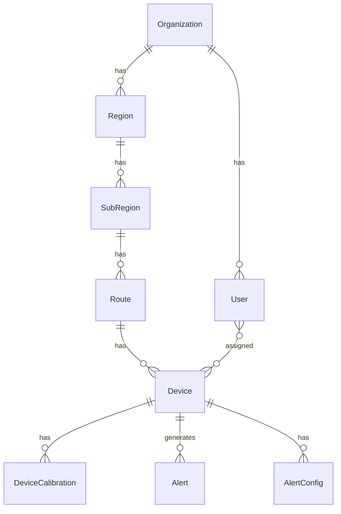

# Milk BMC IoT Monitoring Platform — Implementation Plan

## Overview

Build a cloud-based Industrial IoT platform for monitoring Bulk Milk Coolers (BMCs) across dairy collection centers. The system ingests MQTT telemetry, stores data in PostgreSQL + InfluxDB, provides real-time dashboards, generates alerts, and delivers automated reports.

**ORM Choice**: **Sequelize v6** (as requested — no Prisma). Sequelize provides model definitions, migrations, associations, and query building natively with PostgreSQL.

---

> [!IMPORTANT]
> This plan covers **Phase 1** (Foundation) and **Phase 2** (MQTT + Device + Dashboard). Phases 3–5 will be planned after these are stable. This is a massive project — building incrementally ensures quality.

---

## Phase 1: Backend Foundation + Auth + Organization + Theme

### 1.1 Backend — Project Setup

#### [NEW] [package.json](file:///d:/amitelectric/backend/package.json)

Initialize Fastify backend with all core dependencies:

| Category | Packages |
|---|---|
| Framework | `fastify`, `@fastify/cors`, `@fastify/helmet`, `@fastify/rate-limit`, `@fastify/swagger`, `@fastify/swagger-ui`, `@fastify/multipart`, `@fastify/static` |
| Auth | `@fastify/jwt`, `bcrypt` |
| ORM | `sequelize`, `pg`, `pg-hstore` |
| Validation | `joi` |
| Cache | `ioredis` (DragonflyDB compatible) |
| Time-Series | `@influxdata/influxdb-client` |
| MQTT | `mqtt` |
| Queue | `bullmq` |
| Logging | `pino`, `pino-pretty` |
| Email | `nodemailer` |
| Dev | `nodemon`, `sequelize-cli` |

#### [NEW] Backend Directory Structure

```
backend/
├── package.json
├── .env.example
├── .sequelizerc              # Sequelize CLI config paths
├── src/
│   ├── app.js                # Fastify app factory
│   ├── server.js             # Entry point (starts server)
│   ├── config/
│   │   ├── database.js       # Sequelize connection config
│   │   ├── influxdb.js       # InfluxDB client config
│   │   ├── redis.js          # DragonflyDB/Redis config
│   │   ├── mqtt.js           # MQTT broker config
│   │   └── env.js            # Environment variable loader
│   ├── db/
│   │   ├── migrations/       # Sequelize migrations
│   │   ├── seeders/          # Seed data (super admin, etc.)
│   │   └── models/
│   │       ├── index.js      # Sequelize model loader + associations
│   │       ├── User.js
│   │       ├── Organization.js
│   │       ├── Region.js
│   │       ├── SubRegion.js
│   │       ├── Route.js
│   │       ├── Device.js
│   │       ├── DeviceCalibration.js
│   │       ├── Alert.js
│   │       ├── AlertConfig.js
│   │       ├── AuditLog.js
│   │       ├── Setting.js
│   │       └── Permission.js
│   ├── modules/
│   │   ├── auth/
│   │   │   ├── auth.routes.js
│   │   │   ├── auth.controller.js
│   │   │   ├── auth.service.js
│   │   │   └── auth.schema.js       # Joi schemas
│   │   ├── user/
│   │   │   ├── user.routes.js
│   │   │   ├── user.controller.js
│   │   │   ├── user.service.js
│   │   │   └── user.schema.js
│   │   ├── organization/
│   │   │   ├── organization.routes.js
│   │   │   ├── organization.controller.js
│   │   │   ├── organization.service.js
│   │   │   └── organization.schema.js
│   │   ├── region/
│   │   │   ├── region.routes.js
│   │   │   ├── region.controller.js
│   │   │   ├── region.service.js
│   │   │   └── region.schema.js
│   │   ├── route/
│   │   │   ├── route.routes.js
│   │   │   ├── route.controller.js
│   │   │   ├── route.service.js
│   │   │   └── route.schema.js
│   │   ├── device/
│   │   │   ├── device.routes.js
│   │   │   ├── device.controller.js
│   │   │   ├── device.service.js
│   │   │   └── device.schema.js
│   │   ├── dashboard/
│   │   │   ├── dashboard.routes.js
│   │   │   ├── dashboard.controller.js
│   │   │   └── dashboard.service.js
│   │   ├── alert/
│   │   │   ├── alert.routes.js
│   │   │   ├── alert.controller.js
│   │   │   ├── alert.service.js
│   │   │   └── alert.schema.js
│   │   └── report/
│   │       ├── report.routes.js
│   │       ├── report.controller.js
│   │       └── report.service.js
│   ├── middleware/
│   │   ├── authenticate.js   # JWT verification
│   │   ├── authorize.js      # Role-based access
│   │   ├── validate.js       # Joi validation middleware
│   │   └── auditLog.js       # Audit logging
│   ├── services/
│   │   ├── mqtt.service.js   # MQTT consumer + publisher
│   │   ├── telemetry.service.js
│   │   ├── notification.service.js
│   │   ├── email.service.js
│   │   └── cache.service.js
│   ├── utils/
│   │   ├── response.js       # Standardized API responses
│   │   ├── errors.js         # Custom error classes
│   │   ├── pagination.js     # Pagination helper
│   │   └── constants.js      # Enums, constants
│   └── plugins/
│       ├── swagger.js        # Swagger plugin config
│       └── cors.js           # CORS plugin config
```

---

### 1.2 Database Schema (Sequelize Models + Migrations)

#### Core Tables



**Key Models:**

| Model | Key Fields |
|---|---|
| `User` | id, name, email, password (bcrypt), phone, role (super_admin/user), organizationId, status, lastLogin |
| `Organization` | id, name, code, address, contactEmail, contactPhone, status |
| `Region` | id, name, code, organizationId, status |
| `SubRegion` | id, name, code, regionId, status |
| `Route` | id, name, code, subRegionId, status |
| `Device` | id, deviceCode, deviceName, routeId, tankCapacity, minTankVolume, setTemperature, dieselConsumption, alertMobileNumbers[], firmwareVersion, hardwareVersion, status, lastSeen |
| `DeviceCalibration` | id, deviceId, type (temperature/volume/offset/sensor), parameters (JSONB), calibratedBy, calibratedAt |
| `UserDevice` | userId, deviceId (junction table) |
| `Alert` | id, deviceId, type, severity, message, value, threshold, acknowledged, acknowledgedBy, acknowledgedAt |
| `AlertConfig` | id, deviceId, alertType, threshold, enabled, cooldownMinutes |
| `AuditLog` | id, userId, action, entity, entityId, oldValues (JSONB), newValues (JSONB), ipAddress |
| `Setting` | id, key, value (JSONB), category |

---

### 1.3 Authentication Module

- **POST** `/api/auth/login` — Email + password login → JWT access + refresh tokens
- **POST** `/api/auth/refresh` — Refresh token rotation
- **POST** `/api/auth/logout` — Invalidate session (DragonflyDB)
- **POST** `/api/auth/forgot-password` — Send reset email
- **POST** `/api/auth/reset-password` — Reset with token
- **POST** `/api/auth/otp/send` — OTP for mobile (Android)
- **POST** `/api/auth/otp/verify` — Verify OTP

JWT tokens stored in DragonflyDB with TTL. Role embedded in JWT payload.

---

### 1.4 User Management Module (Super Admin)

- **GET** `/api/users` — List users (paginated, filterable)
- **POST** `/api/users` — Create user
- **GET** `/api/users/:id` — Get user details
- **PUT** `/api/users/:id` — Update user
- **DELETE** `/api/users/:id` — Soft delete user
- **PUT** `/api/users/:id/reset-password` — Admin reset password
- **POST** `/api/users/:id/assign-devices` — Assign devices to user
- **POST** `/api/users/:id/assign-regions` — Assign regions to user

---

### 1.5 Organization / Region / Route Modules

**Organization:**
- CRUD operations at `/api/organizations`

**Region:**
- CRUD at `/api/regions` (scoped to organization)
- Nested sub-regions at `/api/regions/:id/sub-regions`

**Sub-Region:**
- CRUD at `/api/sub-regions`

**Route:**
- CRUD at `/api/routes` (scoped to sub-region)

---

## Phase 2: Device + MQTT + Dashboard + Real-time

### 2.1 Device Management Module

- **CRUD** at `/api/devices`
- **POST** `/api/devices/:id/calibrate` — Set calibration
- **GET** `/api/devices/:id/telemetry` — Latest telemetry from cache
- **GET** `/api/devices/:id/history` — Historical data from InfluxDB

### 2.2 MQTT Consumer Service

```
src/services/mqtt.service.js
```

- Connect to MQTT broker
- Subscribe to `bmc/device/+/telemetry`, `bmc/device/+/status`, `bmc/device/+/heartbeat`
- On message: Validate payload (Joi) → Write to InfluxDB → Update DragonflyDB cache → Check alert rules → Emit WebSocket event

### 2.3 Telemetry Processing Pipeline

```
MQTT Message → Joi Validation → Apply Calibration Offsets → Write InfluxDB → Update Cache → Alert Engine → WebSocket Push
```

### 2.4 Dashboard Service

- **GET** `/api/dashboard/summary` — Widget data (totals, online/offline, volumes, alerts)
- **GET** `/api/dashboard/devices` — All devices with live status from cache
- **WebSocket** `/ws/dashboard` — Real-time push updates

---

## Phase 1: Frontend Foundation + Theme + Auth

### Frontend Directory Structure

```
frontend/src/
├── main.jsx
├── App.jsx
├── index.css                    # Global styles + Tailwind
├── api/
│   ├── axios.js                 # Axios instance with interceptors
│   ├── auth.api.js
│   ├── user.api.js
│   ├── device.api.js
│   ├── region.api.js
│   ├── route.api.js
│   └── dashboard.api.js
├── context/
│   ├── AuthContext.jsx
│   └── ThemeContext.jsx
├── hooks/
│   ├── useAuth.js
│   ├── useDevices.js
│   └── useWebSocket.js
├── layouts/
│   ├── AdminLayout.jsx          # Sidebar + Header + Content
│   ├── AuthLayout.jsx           # Login/Register pages
│   └── components/
│       ├── Sidebar.jsx
│       ├── Header.jsx
│       ├── Breadcrumb.jsx
│       └── ThemeToggle.jsx
├── pages/
│   ├── auth/
│   │   ├── LoginPage.jsx
│   │   └── ForgotPasswordPage.jsx
│   ├── dashboard/
│   │   └── DashboardPage.jsx
│   ├── users/
│   │   ├── UserListPage.jsx
│   │   ├── UserCreatePage.jsx
│   │   └── UserEditPage.jsx
│   ├── devices/
│   │   ├── DeviceListPage.jsx
│   │   ├── DeviceCreatePage.jsx
│   │   ├── DeviceDetailPage.jsx
│   │   └── DeviceCalibrationPage.jsx
│   ├── regions/
│   │   ├── RegionListPage.jsx
│   │   └── SubRegionListPage.jsx
│   ├── routes/
│   │   └── RouteListPage.jsx
│   ├── alerts/
│   │   └── AlertListPage.jsx
│   └── reports/
│       └── ReportPage.jsx
├── components/
│   ├── ui/                      # Reusable UI primitives
│   │   ├── Button.jsx
│   │   ├── Input.jsx
│   │   ├── Select.jsx
│   │   ├── Modal.jsx
│   │   ├── Table.jsx
│   │   ├── Card.jsx
│   │   ├── Badge.jsx
│   │   ├── Spinner.jsx
│   │   ├── Toast.jsx
│   │   └── Pagination.jsx
│   ├── dashboard/
│   │   ├── StatCard.jsx
│   │   ├── DeviceStatusGrid.jsx
│   │   └── AlertFeed.jsx
│   ├── device/
│   │   ├── DeviceCard.jsx
│   │   ├── TelemetryPanel.jsx
│   │   ├── CompressorStatus.jsx
│   │   └── PowerStatus.jsx
│   └── charts/
│       ├── TemperatureChart.jsx
│       ├── VolumeChart.jsx
│       └── PowerChart.jsx
└── utils/
    ├── formatters.js
    ├── constants.js
    └── validators.js
```

### Frontend Dependencies to Install

| Package | Purpose |
|---|---|
| `react-router-dom` | Routing |
| `axios` | HTTP client |
| `recharts` | Charts |
| `tailwindcss` `@tailwindcss/vite` | Styling (user-requested) |
| `react-hot-toast` | Toast notifications |
| `lucide-react` | Icons |
| `date-fns` | Date formatting |
| `react-hook-form` | Form management |
| `@tanstack/react-query` | Server state management |
| `socket.io-client` | WebSocket |

### Theme System

```
Colors:
  Primary:    #ff9900 (Orange)
  Secondary:  #ff3366 (Pink-Red)
  Success:    #33cc99 (Green)
  Info:       #66ccff (Blue)
  Warning:    #ffcc00 (Yellow)
  
  Dark BG:    #0f1117 → #1a1d29 → #242836
  Light BG:   #ffffff → #f8f9fc → #eef1f6
```

Dark + Light mode toggle with CSS variables and Tailwind `dark:` classes.

---

## Docker Compose (Infrastructure)

#### [NEW] [docker-compose.yml](file:///d:/amitelectric/docker-compose.yml)

```yaml
services:
  postgres:     # Port 5432
  influxdb:     # Port 8086
  dragonfly:    # Port 6379 (Redis-compatible)
  mosquitto:    # Port 1883 (MQTT) + 9001 (WS)
```

---

## Proposed Changes Summary

### Backend Component

| File | Status | Description |
|---|---|---|
| `package.json` | [NEW] | Dependencies + scripts |
| `.env.example` | [NEW] | Environment template |
| `.sequelizerc` | [NEW] | Sequelize CLI paths |
| `src/server.js` | [NEW] | Entry point |
| `src/app.js` | [NEW] | Fastify app factory with plugins |
| `src/config/*` | [NEW] | Database, Redis, InfluxDB, MQTT, env configs |
| `src/db/models/*` | [NEW] | 12 Sequelize models with associations |
| `src/db/migrations/*` | [NEW] | Database migration files |
| `src/db/seeders/*` | [NEW] | Super admin seed |
| `src/modules/auth/*` | [NEW] | Auth routes, controller, service, schema |
| `src/modules/user/*` | [NEW] | User CRUD module |
| `src/modules/organization/*` | [NEW] | Organization module |
| `src/modules/region/*` | [NEW] | Region + SubRegion module |
| `src/modules/route/*` | [NEW] | Route module |
| `src/modules/device/*` | [NEW] | Device management module |
| `src/modules/dashboard/*` | [NEW] | Dashboard aggregation |
| `src/modules/alert/*` | [NEW] | Alert management |
| `src/middleware/*` | [NEW] | Auth, RBAC, validation, audit |
| `src/services/*` | [NEW] | MQTT, telemetry, notification, email, cache |
| `src/utils/*` | [NEW] | Response helpers, errors, pagination |
| `src/plugins/*` | [NEW] | Swagger, CORS configs |

### Frontend Component

| File | Status | Description |
|---|---|---|
| `package.json` | [MODIFY] | Add dependencies |
| `tailwind.config.js` | [NEW] | Tailwind with custom theme |
| `src/index.css` | [MODIFY] | Tailwind directives + CSS variables |
| `src/App.jsx` | [MODIFY] | Router + providers |
| `src/api/*` | [NEW] | API layer |
| `src/context/*` | [NEW] | Auth + Theme contexts |
| `src/layouts/*` | [NEW] | Admin layout with sidebar |
| `src/pages/*` | [NEW] | All page components |
| `src/components/*` | [NEW] | UI components + domain components |
| `src/hooks/*` | [NEW] | Custom hooks |

### Infrastructure

| File | Status | Description |
|---|---|---|
| `docker-compose.yml` | [NEW] | PostgreSQL + InfluxDB + DragonflyDB + Mosquitto |

---

## Open Questions

> [!IMPORTANT]
> **1. Docker Infrastructure**: Do you already have PostgreSQL, InfluxDB, DragonflyDB, and Mosquitto running, or should I set up a `docker-compose.yml` for the full stack?

> [!IMPORTANT]
> **2. MQTT Broker**: Which MQTT broker are you using? (Mosquitto, EMQX, HiveMQ, etc.) This affects authentication setup.

> [!IMPORTANT]
> **3. Email Provider**: Which SMTP service should be configured? (Gmail, AWS SES, custom SMTP, etc.)

> [!IMPORTANT]
> **4. Deployment Target**: Where will this be deployed? (AWS, GCP, DigitalOcean, self-hosted?) This affects the docker-compose and configuration.

> [!NOTE]
> **5. Phase Execution**: I'll build Phase 1 + Phase 2 first (Backend foundation + Auth + Organization + Devices + MQTT + Dashboard). Phases 3-5 (Alerts, Android, Reports, Analytics) will follow. Is this prioritization correct?

---

## Verification Plan

### Automated Tests
```bash
# Backend
cd backend && npm test           # Unit tests with Jest
npm run test:integration         # Integration tests

# Database
npx sequelize-cli db:migrate     # Run migrations
npx sequelize-cli db:seed:all    # Seed data

# Lint
npm run lint
```

### Manual Verification
- Start all infrastructure via `docker-compose up`
- Run backend with `npm run dev` and verify Swagger docs at `/docs`
- Test login flow with seeded super admin
- Test CRUD operations for Users, Regions, Routes, Devices
- Run frontend with `npm run dev` and verify login → dashboard flow
- Verify dark/light theme toggle
- Test responsive layout on desktop/tablet/mobile viewports
